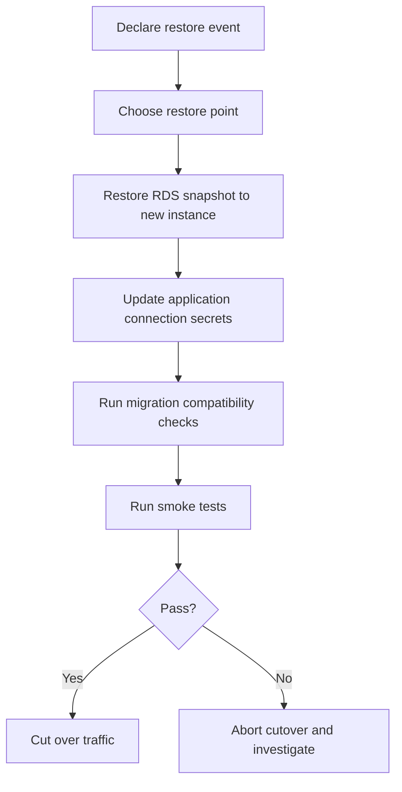

# Backup, Restore, and Incident Runbook

This runbook standardizes data safety and production incident handling for
ArjunaCRM.

## Backup policy

## Databases (RDS PostgreSQL)

- Enable automated backups (minimum 7 days retention).
- Enable deletion protection in production.
- Create manual snapshot before risky schema releases.

## Redis (ElastiCache)

- Enable snapshots where required by business continuity policy.
- Treat Redis as cache-first; ensure system behavior is resilient to cold cache.

## Static assets (S3)

- Enable bucket versioning for frontend/docs assets.
- Keep immutable cache headers for versioned assets.

## Restore drill cadence

- Perform restore drill at least once per quarter.
- Use non-production environment for restore verification.
- Verify application-level integrity after restore.

## Restore flow



## Emergency restore procedure

1. Identify target restore point (timestamp and source snapshot).
2. Restore to a new DB instance:
   ```bash
   aws rds restore-db-instance-from-db-snapshot \
     --db-instance-identifier arjunacrm-db-restore-<timestamp> \
     --db-snapshot-identifier <snapshot-id>
   ```
3. Update secret store values for DB connection URL.
4. Restart backend tasks so new credentials are picked up.
5. Run mandatory smoke tests:
   - auth/login
   - workspace load
   - record CRUD
   - workflow trigger execution
6. Only after successful validation, route production traffic.

## Incident severity model

- **SEV-1**: full outage or data corruption risk
- **SEV-2**: major functionality degraded
- **SEV-3**: minor degradation with workaround

## Incident response checklist

1. Assign incident commander.
2. Declare severity and communication channel.
3. Capture timeline and metrics signals.
4. Mitigate (rollback, scale, or isolate fault).
5. Validate recovery with smoke suite.
6. Publish post-incident report within 48 hours.

## Post-incident report template

- Summary
- User impact
- Root cause
- Detection gaps
- What worked
- What failed
- Follow-up actions with owners and dates
