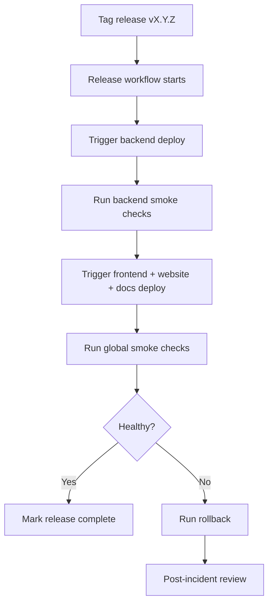

# Deployment and Rollback Runbook

This runbook defines the safest way to deploy ArjunaCRM to production and
rollback quickly when regressions are detected.

## Scope

- Backend API deployment (`deploy-backend.yml`)
- Frontend deployment (`deploy-frontend.yml`)
- Website deployment (`deploy-website.yml`)
- Docs deployment (`deploy-docs.yml`)

## Preconditions (must be green before deployment)

- CI checks for the release commit are successful.
- Migration impact has been reviewed.
- Required GitHub Secrets and repository Variables are set.
- On-call owner is assigned for release monitoring window.

## Deployment flow



## Deployment steps

1. Create release tag and push:
   ```bash
   git tag vX.Y.Z
   git push origin vX.Y.Z
   ```
2. Open Actions tab and track `Release`.
3. Confirm downstream workflows are triggered:
   - Deploy Backend
   - Deploy Frontend
   - Deploy Website
   - Deploy Documentation
4. Validate service health endpoints and core routes:
   - `https://api.vedpragya.com/healthz`
   - `https://app.vedpragya.com`
   - `https://www.vedpragya.com`
   - `https://docs.vedpragya.com`

## Backend rollback

If backend regression is detected:

1. Find previous healthy ECS task definition revision.
2. Update service to previous task definition:
   ```bash
   aws ecs update-service \
     --cluster arjunacrm-cluster \
     --service arjunacrm-server \
     --task-definition arjunacrm-server-task:<REVISION>
   ```
3. Wait for service stabilization and re-run smoke checks.
4. If migration caused incompatibility, execute forward-fix migration (do not
   mutate already-applied migration history).

## Frontend/docs rollback

For static deployments:

1. Restore previous object versions in S3.
2. Invalidate CloudFront cache:
   ```bash
   aws cloudfront create-invalidation \
     --distribution-id <DISTRIBUTION_ID> \
     --paths "/*"
   ```
3. Re-test sign-in and key navigation flows.

## Website rollback

Website runs on ECS container deployment.

1. Roll back to previous task definition revision (same pattern as backend).
2. Confirm service stabilization.
3. Validate `https://www.vedpragya.com` and marketing routes.

## Incident logging checklist

- Record release tag, workflow run IDs, and rollback revision.
- Capture first failure timestamp and impacted services.
- Document root cause and permanent fix PR link.
